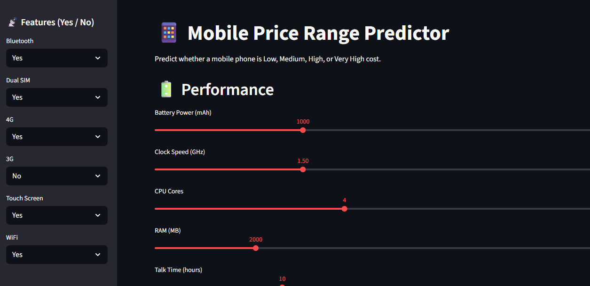

#  Mobile Phone Price Prediction



This project uses Machine Learning to predict the price range of a mobile phone based on its specifications and features.

The model classifies a mobile phone into one of four categories:

| Price Range | Description |
|------------|-------------|
| 0 | Low Cost |
| 1 | Medium Cost |
| 2 | High Cost |
| 3 | Very High Cost |

The project includes:
- Data Analysis (EDA)
- Data Preprocessing
- Model Training
- Model Evaluation
- Streamlit Web Application
- Deployment Ready Structure

## 📂 Project Structure

```text
Mobile-Phone-Pricing/
│
├── app.py
├── mobile_price_model.pkl
├── requirements.txt
├── README.md
├── dataset.csv
├── .gitignore
│── Mobilepriceprediction.ipynb
```


## 📈 Machine Learning Workflow

### 1. Data Collection
- Load dataset
- Inspect data structure

### 2. Exploratory Data Analysis (EDA)
- Data overview
- Missing value analysis
- Feature distribution analysis
- Correlation analysis

### 3. Data Preprocessing
- Feature selection
- Train-test split

### 4. Model Training
- Random Forest Classifier

### 5. Model Evaluation
- Accuracy Score
- Confusion Matrix
- Classification Report

### 6. Model Saving
- Joblib serialization

### 7. Deployment
- Streamlit Web Application

## 🚀 Running the Application

### Clone Repository

```bash
git clone <your-repository-url>
cd Mobile-Phone-Pricing
```

### Install Dependencies

```bash
pip install -r requirements.txt
```

### Run Streamlit App

```bash
streamlit run app.py
```
## 🌐 Live Demo

```text
https://malshiprabodha-mobile-price-range-prediction--app-nlvpgm.streamlit.app/
```


